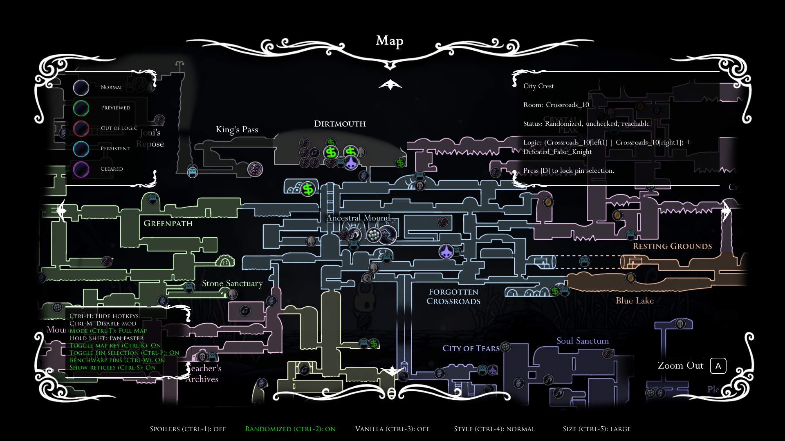
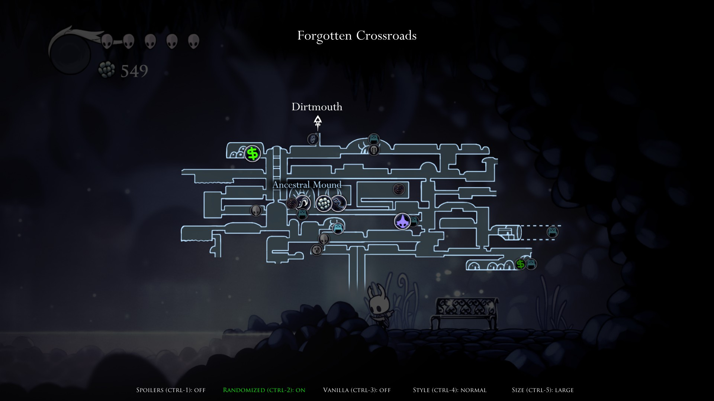
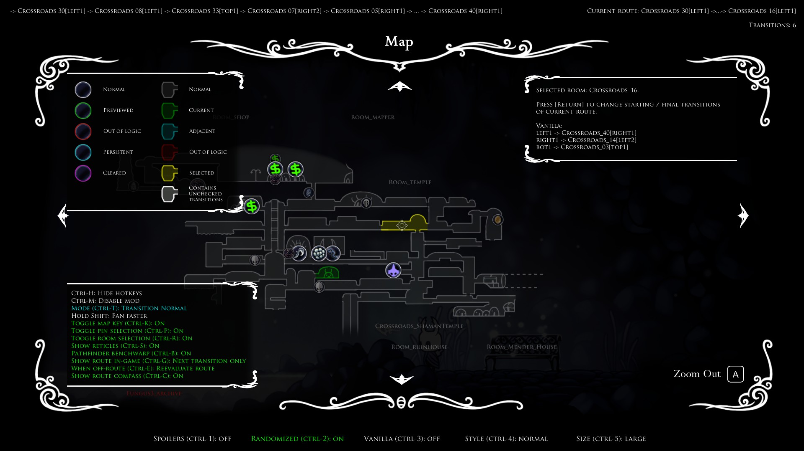

# RandoMapMod

RandoMapMod is a Hollow Knight mod for Randomizer 4 that adds many new features to the map.

The mod helps with tracking both items and transitions, and is compatible with several existing connection mods.

This version is the successor to MapModS, updated to work with the MapChanger library.

# Dependencies:
- [Randomizer 4](https://github.com/homothetyhk/RandomizerMod) and all of its dependencies.
- [RCPathfinder](https://github.com/syyePhenomenol/RCPathfinder)
- [MapChanger](https://github.com/syyePhenomenol/MapChanger)
- [MagicUI](https://github.com/BadMagic100/HollowKnight.MagicUI)
- [ConnectionMetadataInjector](https://github.com/BadMagic100/ConnectionMetadataInjector)

Please make sure all of the above mods are installed and up to date.

Optional and compatible:
- [AdditionalMaps](https://github.com/SFGrenade/AdditionalMaps). Adds pins to white palace and godhome maps
- [RandomizableLevers](https://github.com/flibber-hk/HollowKnight.RandomizableLevers). Shows lever checks on map
- [RandoPlus](https://github.com/flibber-hk/HollowKnight.RandoPlus). Shows Mr Mushroom and nail upgrade checks on map
- [BenchRando](https://github.com/homothetyhk/BenchRando/tree/master/BenchRando). Shows bench checks on map
- [TheRealJournalRando](https://github.com/BadMagic100/TheRealJournalRando). Shows journal entry checks on map
- Various other connection mods.

# Screenshots

Click to expand

    
    
    
    

# Quick Start Guide
- Press `CTRL-M` during a game to enable the mod. Alternatively, click the red button when the game is paused.
- The following videos were originally made for MapModS, but this mod functions very similarly.
    - [fireb0rn's quick MapModS guide (item randomizer)](https://www.youtube.com/watch?v=z35cFvU0McQ&t=1113s)
    - [fireb0rn's quick MapModS guide (transition randomizer)](https://www.youtube.com/watch?v=z35cFvU0McQ&t=1195s)

# Features
## World Map / Quick Map
- Big pins: Items are reachable according to Randomizer logic.
- Small/grayed out pins: Items are not randomized or not reachable.
- Pins will disappear as you clear their locations. If item previews are enabled, it will show the corresponding previewed item.
- Pin settings are displayed at the bottom. See [Pause Menu](#pause-menu) for more info on the toggles.
- ``CTRL-H``: Expand/collapse the hotkey panel
- ``CTRL-M``: Toggle map enabled/disabled
- ``CTRL-T``: Toggle map mode
- ``SHIFT``: Pan faster (same as right thumbstick on controller).
- ``CTRL-K``: Toggle a panel for the map key.
- ``CTRL-G``: Toggle progress hint between revealing area/room/item location or off.
    - If enabled, press the indicated key/controller bind to reveal a random hint of where to check to unlock further progression. It will automatically pan to the relevant area on the map.
    - You can press the bind again to randomly cycle through other available hints.
- ``CTRL-C``: Toggle item compass on/off.
- ``CTRL-P``: Toggle pin selection on/off.
    - Hover over any visible pin to display info about the name, room, status, logic requirements, previewed items (if any) and spoiler items (if Spoilers on).
    - For some locations, you can press the indicated key/controller bind to reveal a hint to find it.
    - Press the indicated key/controller bind to lock and pan away from the current selection.
- ``CTRL-W``: Toggle benchwarp pins on/off.
    - With pin selection on, you can press the indicated key/controller bind to warp to the selected bench.
- ``CTRL-S``: Toggle selector reticles on/off.

## Pause Menu
- "Map Mod Enabled/Disabled" `CTRL-M`: Toggle the mod on/off
- "Spoilers" `CTRL-1`: Toggle pins between vanilla (non-spoiler) and spoiler item pools. For most gameplay, leave this setting off.
- "Randomized" `CTRL-2`: Toggle all pins for randomized items on/off
- "Vanilla" `CTRL-3`: Toggle all pins for non-randomized items on/off
- "Pin Shape" `CTRL-4`: Toggle the shape of the pins
- "Pin Size" `CTRL-5`: Toggle the size of the pins
- "Mode": Toggle the map mode
    - "Full Map": Shows all pins and the full map regardless of map items obtained
    - "All Pins": Shows all pins, but only show map areas for obtained map items
    - "Pins Over Area": Only show pins for areas visible on the map (i.e. you have the map item for that area)
    - "Pins Over Room": Only show pins for rooms that are visible on the map (i.e. you have the map item for that area, and you have visited the room with Quill or that room is visible by default)
    - "Transition 1": Normal transition mode. See more info below.
    - "Transition 2": Transition mode, only showing visited rooms.
    - "Transition 3": Transition mode, showing all rooms.
- "Customize Pools":
    - Toggle showing each pool of pins on/off.
    - "Group by": Toggle the pools to be grouped by location, or by item (spoiler).
- "More Pin Options":
    - "Cleared Locations": Toggle showing pins between all cleared locations/persistent locations/neither.
    - "Indicate Reachable": Toggle indicating (by shading and shrinking pins) if locations are reachable in logic or not
    - "Q Marks": Toggle between normal and question mark pins. Check out the [Map Legend](./MAPLEGEND.md) for more details on each style.
- "Pathfinder Options":
    - "Route Compass": Toggle showing the route compass when a path is selected.
    - "Route Text": Toggle the route to be displayed in-game to full/next transition only/off.
    - "Off Route": Toggle behaviour when going off-route to keep route/cancel route/reevaluate route.
- "Misc. Options":
    - "Item Compass Mode": Toggle item compass between pointing to reachable items/reachable items with sequence break/all items
    - "Show Area Names": Toggle showing area names on the world map
    - "Show Next Areas": Toggle showing names/arrows for adjacent map areas on the quick map
    - "Show Map Markers": Toggle showing map markers. You still need to buy the map markers to see them with this setting on.
    - "Always Have Quill": Fill in rooms even if you haven't picked up Quill. Doesn't affect Full Map or Transition modes.
    - "Def. Item Mode": Toggle which map mode is set by default for a new item rando save.
    - "Def. Transition Mode": Toggle which map mode is set by default for a new transition rando save.
    - "Reset Global Settings": Resets all global settings to default settings
    

## Transition Mode
- Check out the in-game map key (`CTRL-K`) or the [Map Legend](./MAPLEGEND.md) for what the colors/brightness of each room indicate.
- ``CTRL-R``: Toggle room selection on/off.
    - Hover over a room and press the indicated key/controller bind to find a path.
    - If successful, the path route will be displayed. You can try again to change the start/final transition to what you want.
    - If the first step in the route is to benchwarp, hold the indicated key/controller bind to do the benchwarp.
    - A compass arrow will point to the next transition you need to go to. The shown route gets updated after every transition.
    - The Quick Map also shows the list of unchecked/visited/vanilla transitions for the current room.
- `CTRL-B`: Toggle including benchwarp in the pathfinder on/off.

## Customization
- To customize map and UI colors, download the [template file](https://github.com/syyePhenomenol/RandoMapMod/releases/download/v3.0.0/colors.json) and copy it to the same folder that contains the mod file ``RandoMapMod.dll``. You only need to quit a save and re-enter one to reload the colors.
    - For Steam + Scarab users on Windows, the default folder is `...\Steam\steamapps\common\Hollow Knight\hollow_knight_Data\Managed\Mods\RandoMapMod`.
    - Colors will be interpreted in standard RGBA format ``[r, g, b, a]``.
    - If you want to keep the default color of something, delete the corresponding line in the file (or change ``[r, g, b, a]`` to ``[]``).

# How To Install
Use Scarab: https://github.com/fifty-six/Scarab

Or, you can install manually:
1. Download the latest release of `RandoMapMod.zip`.
2. Unzip and copy the folder 'RandoMapMod' to `...\hollow_knight_Data\Managed\Mods`.

If you need any help, feel free to ask in any of the active Hollow Knight Discord servers.

# For Developers
- Pins are automatically generated for each connection-provided placement with "best-guess" behaviour for position/displayed sprite.
- To override this default behaviour with your connection mod, see [here](./RandoMapMod/Pins/InteropProperties.cs).

# Acknowledgements
- Special thanks to Homothety, Flib and BadMagic for significant coding help
- CaptainDapper for making the original mod
- PimpasPimpinela for helping to port the mod from Rando 3 to Rando 4
- Chaktis, KingKiller39 and Ender Onryo for helping with sprite art
- ColetteMSLP for testing out the mod during livestreams
